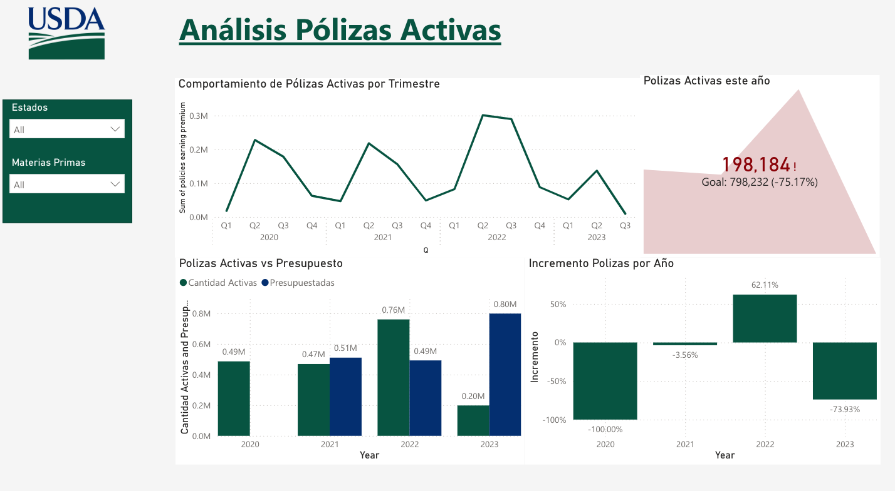

Analista de operaciones con más de 6 años en Inteligencia de negocios (BI) y optimización de procesos con resultados medibles y logros alcanzados. Con pensamiento crítico para reconocer las necesidades y oportunidades en el ecosistema empresarial. Conocimientos e implementación de indicadores (KPI) con experiencia en Power BI, Google Looker Studio, SQL, ETL en SSIS y Python. Soy un profesional comprometido con los objetivos de área, trabajo en equipo, creativo e innovador en procesos y orientado a los resultados.

# Contacto

* +57 3105719796
* camilodiaz232@hotmail.com
* www.linkedin.com/in/diazpulgarcamiloandres

# Proyectos

## 1. Análisis de Clúster con Python

Análisis del uso de tarjetas de crédito [link](https://github.com/camilodiaz232/cluster_tarjetaCredito/blob/main/main.ipynb){:target="_blank"}

## 2. Análisis de Contoso con SQL

Respondiendo preguntas claves de las ventas de contoso con SQL [link](https://github.com/camilodiaz232/Analisis-SQL-en-Contoso){:target="_blank"}

### *Top 10 Clientes con Mayor Incremento de Ventas*

| Customer              | 2007        | 2008         | Increase_2008 | 2009       | Increase_2009 |
|-----------------------|-------------|--------------|---------------|------------|---------------|
| VersaillesCompany     | 344153.99   | 17590407.91  | 5011.20       | 22577.60   | -99.88        |
| AlbanyCompany         | 2111.34     | 2444283.47   | 115669.46     | 4594.20    | -99.82        |
| AlexandriaCompany     | 1486.21     | 2901824.22   | 195150.34     | 5231.75    | -99.82        |
| AnchorageCompany      | 3970.80     | 3084246.19   | 77573.18      | 5807.11    | -99.82        |
| GoulburnCompany       | 3442.46     | 13275476.99  | 385539.53     | 36221.02   | -99.73        |
| Sabrina Sanz          | 21261.31    | 7686.89      | -63.85        | 23.80      | -99.70        |
| Hailey Alexander      | 22950.18    | 7689.28      | -66.50        | 23.80      | -99.70        |
| Lawrence Vazquez      | 26250.16    | 7580.05      | -71.13        | 23.80      | -99.69        |
| Gabriel Parker        | 28364.19    | 7620.85      | -73.14        | 23.80      | -99.69        |
| Kristopher Gonzalez   | 30430.99    | 7587.70      | -75.07        | 23.80      | -99.69        |

## 2. Análisis de Seguros Agricolas con PowerBI
Este analisis se parte de una relacion de seguros agricolas de USDA, y esta disponible en [link](https://app.powerbi.com/view?r=eyJrIjoiNDUyNmViM2ItZmFiMy00MmZkLTllNWMtNjc5ZmIyODAwMmE0IiwidCI6ImMwNmZiNTU5LTFiNjgtNGI4NC1hMTRmLTQ3ZDBkODM3YTVhYiIsImMiOjR9&pageName=cba31ff6d76a65232e5f){:target="_blank"}

---------------------------------------------------------

# Estudios 

**Ingeniería de Sistemas**
Universidad EAN *(julio 2021 – pendiente acto de grado)*

**Especialización de Gerencia Logística**
Universidad La Sabana *(abril 2016 - agosto 2017)*

**Especialización en Producción Y Operaciones**
Universidad Sergio Arboleda *(agosto 2012 - marzo 2014)*

**Data Analysis and Visualization**
Talento Tech, Bootcamp 159 hr *(octubre 2024)* [Certificado](https://certificados.talentotech.co/?cert=2387083045#pdf)

**Curso de Analista de Datos en Power BI**
Ean X *(enero 2023)* [Certificado](https://app.certika.co/verify/certificate-code?code=0XTsEz9DRC)

**Diplomado en Gerencia de Proyectos**
Universidad de la Sabana *(julio 2014 - octubre 2014)*

# Skills Técnicos

*   SQL Language
*   Python – Data Analyst
*   Power BI
*   Google Looker Studio
*   Excel
*   Google Sheets
*   ETL – SSIS
*   Reporting - SSRS

