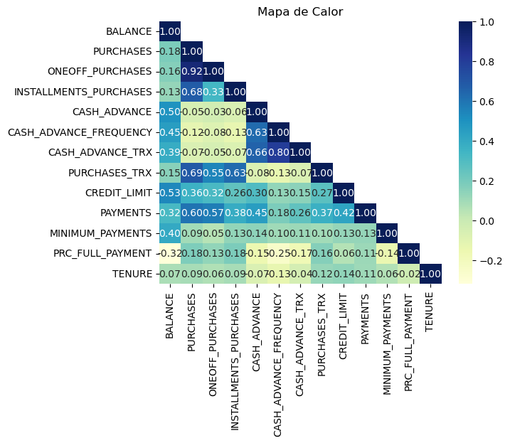
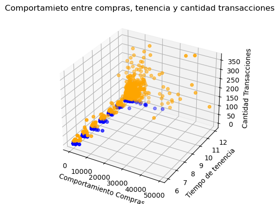
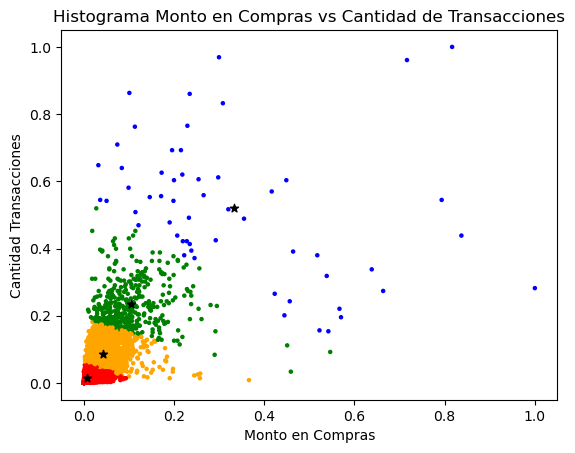

Analista de operaciones con más de 6 años en Inteligencia de negocios (BI) y optimización de procesos con resultados medibles y logros alcanzados. Con pensamiento crítico para reconocer las necesidades y oportunidades en el ecosistema empresarial. Conocimientos e implementación de indicadores (KPI) con experiencia en Power BI, Google Looker Studio, SQL, ETL en SSIS y Python. Soy un profesional comprometido con los objetivos de área, trabajo en equipo, creativo e innovador en procesos y orientado a los resultados.

# Contacto

* +57 3105719796
* camilodiaz232@hotmail.com
* www.linkedin.com/in/diazpulgarcamiloandres

# Proyectos

## 1. Análisis de Clúster con Python

Análisis del uso de tarjetas de crédito [link](https://github.com/camilodiaz232/cluster_tarjetaCredito/blob/main/main.ipynb){:target="_blank"}

# Estudios 

**Ingeniería de Sistemas**
Universidad EAN *(julio 2021 – pendiente acto de grado)*

**Especialización de Gerencia Logística**
Universidad La Sabana *(abril 2016 - agosto 2017)*

**Especialización en Producción Y Operaciones**
Universidad Sergio Arboleda *(agosto 2012 - marzo 2014)*

**Data Analysis and Visualization**
Talento Tech, Bootcamp 159 hr *(octubre 2024)*

**Curso de Analista de Datos en Power BI**
Ean X *(enero 2023)*

**Diplomado en Gerencia de Proyectos**
Universidad de la Sabana *(julio 2014 - octubre 2014)*

# Skills Técnicos

*   SQL Language
*   Python – Data Analyst
*   Power BI
*   Google Looker Studio
*   Excel
*   Google Sheets
*   ETL – SSIS
*   Reporting - SSRS

